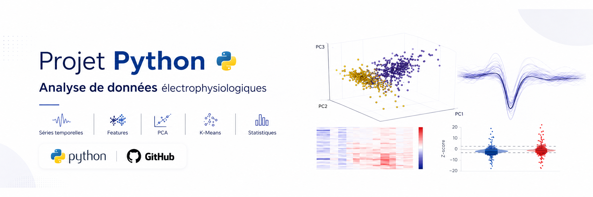
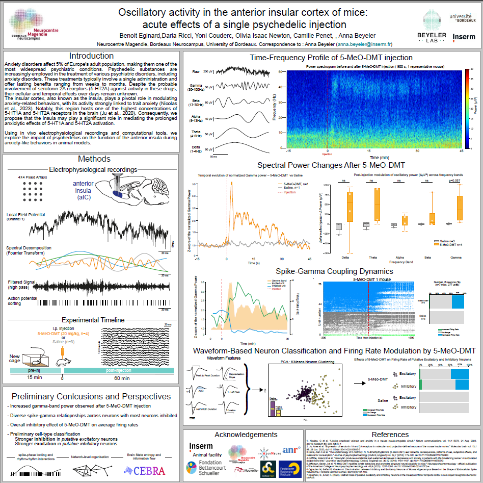
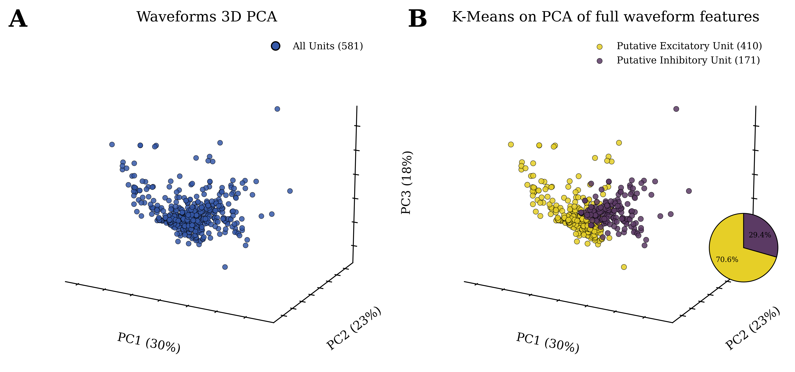
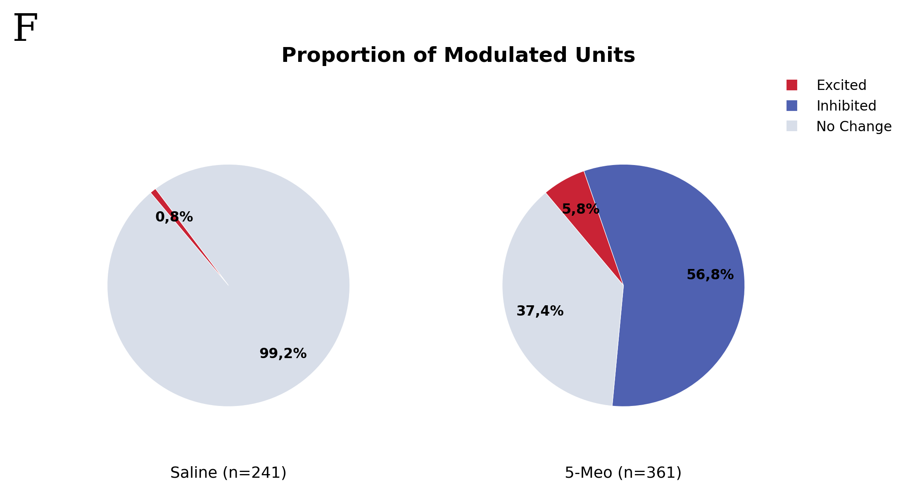
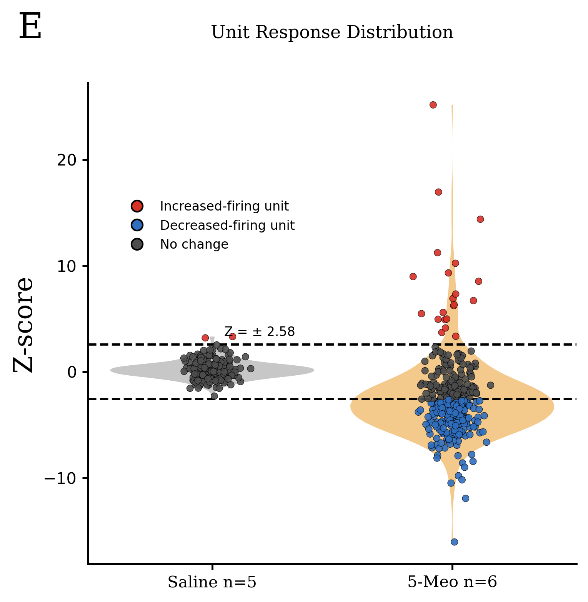

# Neural Unit Clustering and Response Analysis



## Overview

This project analyzes processed electrophysiological single-unit data from mice.

The goal is to demonstrate a clean and reproducible data analysis workflow using processed neural data:

1. classify neural units based on waveform-derived features using PCA and K-Means clustering;
2. analyze firing-rate response profiles between experimental groups;
3. communicate the results through clear visualizations and statistical summaries.

This repository is designed as a lightweight and readable version of a larger research analysis pipeline.

The emphasis is on data cleaning, dimensionality reduction, clustering, statistical comparison, and clear communication of results.

###  Project status

This repository is portfolio-oriented and focuses on processed data analysis rather than raw signal processing.

---

## Project context

The original work was conducted as part of a Master’s research project in computational neuroscience.

The full experimental pipeline involved extracellular electrophysiological recordings, spike sorting, waveform feature extraction, and firing-rate analysis.

Because the raw electrophysiological recordings are several hundred GB and are not publicly shareable, this repository focuses on the analysis of processed CSV outputs.

The objective here is not to reproduce the raw signal-processing pipeline, but to show how processed scientific data can be cleaned, analyzed, visualized, and interpreted using Python.

### Symposium Context

This analysis is derived from a broader Master’s research project in computational neuroscience, focused on the acute effects of a single psychedelic injection on neural activity in the mouse anterior insular cortex.
The full Master’s thesis **" Acute impact of a psychedelic injection on neural oscillations in the mouse insular cortex "**  associated with this research project is also available in the `figures/thesis_figures/` folder:

[Open full Master’s thesis](figures/thesis_figures/master_thesis.pdf)
Part of this work was presented at the **12th Symposium of the Neurocentre Magendie** in April 2025, under the title:

**Oscillatory activity in the anterior insular cortex of mice: acute effects of a single psychedelic injection**

The symposium poster included the broader experimental context, electrophysiological recordings, time-frequency analysis, spectral power changes, spike-gamma coupling, waveform-based neuron classification, and firing-rate modulation analyses.

The present repository focuses specifically on the reproducible Python analysis of processed single-unit data, including waveform-based clustering and firing-rate response classification.



---

## Data

This project mainly relies on two processed unit-level datasets:

- `combined_results.csv`
- `unit_classification_all_mice.csv`

Additional processed CSV files are generated or used for summary-level analyses:

- `unit_waveform_clusters.csv`
- `response_summary_by_group.csv`
- `response_summary_5meo_by_putative_celltype.csv`

### `combined_results.csv`

Unit-level waveform and firing-rate features.

Each row corresponds to one neural unit.

Main columns:

- `mouse_id`
- `group`
- `unit_id`
- `duration`
- `half_width_duration`
- `peak_amplitude_asymmetry`
- `peak_to_trough_ratio`
- `duration_between_peaks`
- `one_minus_left_peak`
- `area_after_min`
- `repolarization_slope`
- `firing_rate`

This dataset is used for waveform-based clustering.

### `unit_classification_all_mice.csv`

Unit-level response classification based on firing-rate modulation.

Main columns:

- `mouse_id`
- `group`
- `unit_id`
- `zscore_mean_after`
- `response_status`

Response status was defined using post-event firing-rate Z-scores:

- `excited`: mean Z-score > +2.58
- `inhibited`: mean Z-score < -2.58
- `no_change`: otherwise

---

## Repository structure

```text
neural-unit-clustering-response-analysis/
│
├── README.md
├── requirements.txt
├── 01_waveform_clustering.ipynb
├── 02_response_analysis.ipynb
│
├── data/
│   └── processed/
│       ├── combined_results.csv
│       ├── response_summary_5meo_by_putative_celltype.csv
│       ├── response_summary_by_group.csv
│       ├── unit_classification_all_mice.csv
│       └── unit_waveform_clusters.csv
│
└── figures/
    ├── project_banner_python_ephys.png
    ├── figure_A_waveforms_3d_pca_all_units.png
    ├── figure_AB_waveforms_3d_pca_kmeans_panel.png
    ├── figure_B_waveforms_3d_pca_kmeans_clusters.png
    ├── qc_zscore_histogram_by_group.png
    ├── response_status_pie_by_group.png
    ├── response_status_pie_by_putative_celltype.png
    ├── zscore_distribution_violin_by_group.png
    ├── interactive_3d_pca_waveform_clusters.html
    │
    └── thesis_figures/
        ├── Figures_5.pdf
        ├── Figures_5_Page_1.png
        ├── Figures_5_Page_2.png
        ├── symposium_poster_overview.png
        ├── symposium_presentation.pdf
        └── master_thesis.pdf
```


## Analysis workflow 

### 1. Waveform-based clustering 

- `01_waveform_clustering.ipynb`

This notebook performs:

- loading of processed unit-level features;
- feature selection;
- feature scaling;
- PCA dimensionality reduction;
- K-Means clustering;
- cluster-level interpretation using waveform and firing-rate features.

The purpose is to identify groups of neural units based on their electrophysiological profile.

### 2. Firing-rate response analysis 

- `02_response_analysis.ipynb`

This notebook performs:

- loading of unit-level response classifications;
- cleaning and validation of categorical labels;
- computation of response counts and proportions;
- comparison between experimental groups;
- visualization of response status distributions;
- statistical comparison using a chi-square test.

The purpose is to evaluate whether the distribution of unit responses differs between groups.

## Key results

1. Waveform clustering

PCA and K-Means clustering were used to identify structure in waveform-derived features.

The clustering analysis shows that neural units can be separated based on variables such as:

- waveform duration
- half-width duration
- peak-to-trough ratio
- repolarization slope
- firing rate

This provides an unsupervised framework for exploring putative neural populations from processed electrophysiological features.

2. Response analysis

The firing-rate response analysis shows a strong difference in response profiles between experimental groups.

In the 5-MeO-DMT group, a large proportion of units were classified as inhibited, while saline controls were mostly classified as unchanged.

This suggests a marked shift in unit-level activity after the experimental event.

## Figures Preview

### Waveform clustering

PCA and K-Means clustering were used to explore structure in waveform-derived features.




### Response status by group

The response analysis compares the proportion of excited, inhibited and unchanged units between experimental groups.



### Z-score distribution by group

Z-score distributions summarize firing-rate modulation after the experimental event.




## Methods

- Main Python libraries used:

  - pandas
  - numpy
  - scikit-learn
  - scipy
  - matplotlib
  - plotly

- Main analytical methods:

  - data cleaning;
  - feature scaling;
  - PCA;
  - K-Means clustering;
  - Z-score-based response classification;
  - group-level proportion analysis;
  - chi-square test;
  - data visualization.

## Skills demonstrated

This project demonstrates practical data analysis skills transferable to data analyst roles:

working with processed real-world scientific data;
cleaning and validating tabular datasets;
selecting and scaling numerical features;
applying dimensionality reduction;
using unsupervised clustering;
comparing categorical distributions between groups;
creating clear visual summaries;
communicating technical results in a concise and reproducible format.

## Limitations

The original raw electrophysiological recordings are not included in this repository due to file size and sharing constraints.

This means that the repository does not reproduce:

raw signal loading;
spike sorting;
manual curation;
raw firing-rate extraction.

Instead, it focuses on the reproducible analysis of processed outputs generated by the upstream pipeline.

This is a common situation in applied data analysis, where analysts often work from transformed, aggregated, or feature-engineered datasets rather than raw source data.

## Original full pipeline

The complete research pipeline included:

1. raw electrophysiological recordings from implanted mice;
2. spike sorting and manual unit curation;
3. extraction of waveform-level features from curated units;
4. unsupervised clustering of putative neuronal populations;
5. firing-rate binning and baseline-normalized Z-score computation;
6. classification of units as excited, inhibited, or unchanged;
7. group-level statistical comparison and visualization.

The present repository starts from the processed CSV outputs generated by this pipeline, because the raw recordings are several hundred GB and cannot be shared publicly.


## How to run

Clone the repository:

git clone git clone https://github.com/benoiteginard-hub/Neural-Unit-Clustering-and-Response-Analysis.git
cd neural-unit-clustering-response-analysis

Install dependencies:

pip install -r requirements.txt

Run the notebooks in order:

01_waveform_clustering.ipynb
02_response_analysis.ipynb

## Portfolio note

This project is part of a broader data portfolio.

A complementary project focuses on oscillatory brain dynamics using spectral analysis, PSD, and FOOOF.

Together, these projects demonstrate the ability to analyze complex scientific data using Python, while additional portfolio projects focus on SQL, Power BI, and business-oriented data analysis.


 
 
